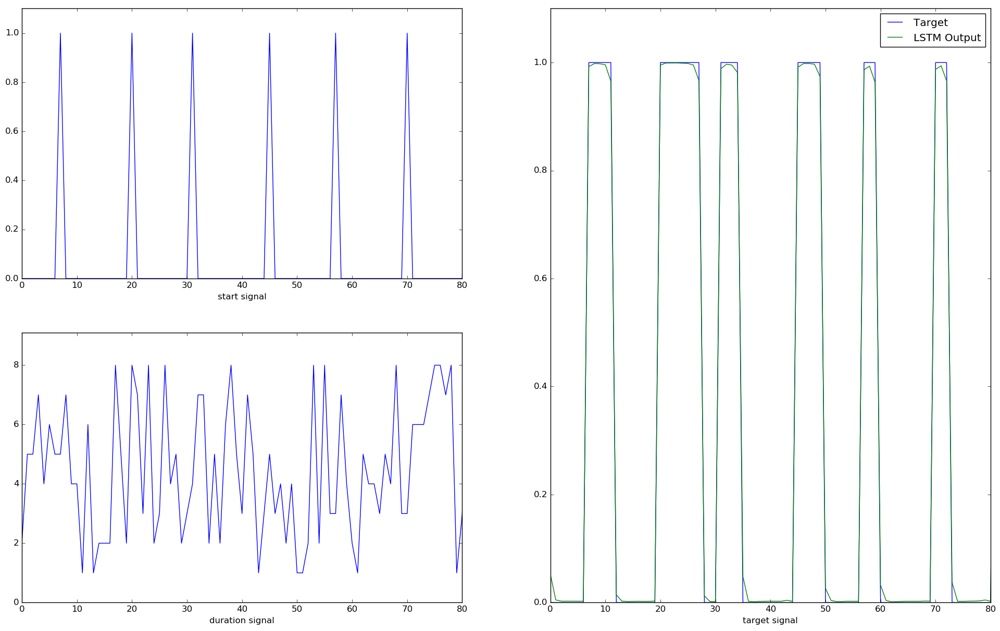

# Recurrent Neural Network Framework

[](https://travis-ci.com/joergfranke/rnnfwk)
[](https://github.com/joergfranke/rnnfwk/blob/master/LICENSE.txt)
[](https://www.python.org/download/releases/2.7/)
[](http://deeplearning.net/software/theano/)

## About
This recurrent neural network framework implements a deep bidirectional LSTM recurrent neural network in Python with use of the
[Theano](http://deeplearning.net/software/theano/) library. The intension is a light weight flat implementation with
the opportunity to test easily new ideas and to implement the latest research.

__Current implemented features:__
- bidirectional LSTM Layers
- Softmax
- RMSprop
- AdaDelta
- Dropout
- Identity function layer-wise
- Weighted cross-entropy loss
- Noisy inputs


__Example of use:__

<table>
  <tr>
    <td><a href="https://github.com/joergfranke/rnnfwk/tree/master/examples/little_timer_task">Little timer task</a></td>
    <td></td>
  </tr>
</table>


## How to install it

```bash
git clone https://github.com/joergfranke/rnnfwk.git
cd rnnfwk
python setup.py install
```

## Further work

- Tests
- Implementations:
    - Layer-Normalization
    - GPU Layers
    - Mix of SGD and AdaDelta