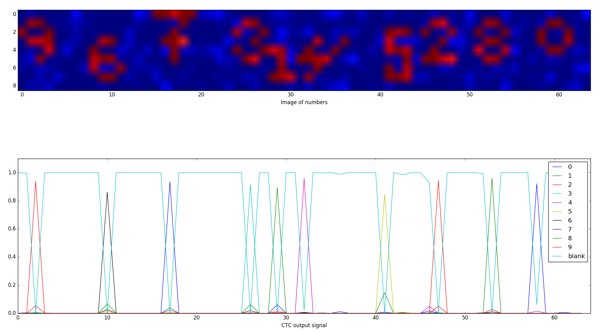

## Number Recognition using CTC

This example is based on a toy training example from [Rakesh Var](https://github.com/rakeshvar/rnn_ctc). A model recognize
numbers from a generated image using the CTC loss function.

<table>
  <tr>
    <td></td>
  </tr>
</table>

### How to use it

1. Install:
    - [recnet](https://github.com/joergfranke/recnet/blob/master/README.md).
    - [requirements.txt](https://github.com/joergfranke/recnet/tree/master/examples/numbers_recognition/requirements.txt)
1. Generate data set
    - Run `make_data_set.py`
2. Train model
    - Run `train_model.py`
3. Use model
    - Add name of the network parameter file from outcome to `use_model.py`
    - Run `use_model.py`

